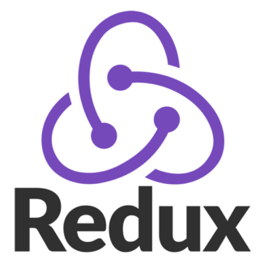

# Online Doctor Consultation Project 

# This project is under development - some features are not available yet

Live link:  https://exoclinic.herokuapp.com/

## Tech Stack

| Stack    | -                                                                                                  | -                                                                                                 | -                                                                                                | -                                                                                                                | -                                                                                                   |
| -------- | -------------------------------------------------------------------------------------------------- | ------------------------------------------------------------------------------------------------- | ------------------------------------------------------------------------------------------------ | ---------------------------------------------------------------------------------------------------------------- | --------------------------------------------------------------------------------------------------- |
| FrontEnd | 
  React
 | 
  Redux
 | 
  Sass
 | 
  Material-UI
 | 
  Axios

| BackEnd  | 
  NodeJS
   | 
  MongoDB
 | 
  Heroku
 | 
  Express
| 
  Socket.io
 |
